```{r xaringan-themer, include=FALSE, warning=FALSE}
#This block contains the theme configuration for the CSS lab slides style
library(xaringanthemer)
library(showtext)
style_mono_accent(
  base_color = "#5c5c5c",
  text_font_size = "1.5rem",
  header_font_google = google_font("Arial"),
  text_font_google   = google_font("Arial", "300", "300i"),
  code_font_google   = google_font("Fira Mono")
)
```

```{r setup, include=FALSE}
options(htmltools.dir.version = FALSE)
```

layout: true

<div class="my-footer"><span>Social Data Science with Python - KOMEX</span></div> 

---

# David Garcia: Intro

.pull-left[
.center[
```{r, echo=FALSE, out.width=270}
knitr::include_graphics("Profile.jpg")
```
]]

.pull-right[
<br>
Website: [dgarcia.eu](https://dgarcia.eu)

Twitter: [@dgarcia_eu](https://twitter.com/dgarcia_eu)

Github: [dgarcia-eu](https://github.com/dgarcia-eu)

Email: david.garcia@uni-konstanz.de
]

- Professor for Social and Behavioral Data Science, University of Konstanz
- Faculty member of the Complexity Science Hub Vienna
- Privatdozent at ETH Zurich and TU Graz

---
background-image: url(AboutUS.svg)
background-size: 98%
---

## Research lines
```{r, echo=FALSE, out.width=1000, fig.align='center'}
knitr::include_graphics("Topics2-2.svg")
```

---
```{r, echo=F}
magick::image_read_pdf("indiraIntro.pdf", pages = 1)
```
---
```{r, echo=F}
magick::image_read_pdf("indiraIntro.pdf", pages = 2)
```
---

# Overview

## 1. Course information

## 2. Introduction to Social Data Science

## 3. Google Flu Trends

## 4. Future Orientation with search data

---

# Course basics

**Objectives:**
- Get an idea of the Data Science Workflow.
- Have an overview on some important libraries for data analysis.
- Get introductory experience on finding, getting, and wrangling data from the Web, Data Visualization, Machine Learning and text mining.

**Assignments:**

- Daily in-class exercises to be solved individually or in groups
- Final individual project to conceptualize a research project, collect and analyze social data with individual written reports

**Evaluation: pass/fail based on individual written reports**

---

# Course topics

- **Day 1: Introduction to Social Data Science**
  - Google search data analysis


- **Day 2: Social Impact**
  - Accessing the Reddit API
  

- **Day 3: Computational Affective Science and NLP**
  - Applying and evaluating sentiment analysis


- **Day 4: Introduction to networks**
  - Handling Twitter data with NetworkX


- **Day 5: Network analysis**
  - Assortativity of Swiss politicians on Twitter

---

# Logistics: Our Social Dinner

.pull-left[
**Location: Restaurant Defne**
In Petershausen, near Sternenplatz

**Date options:**

  1- Tuesday 27th

  2- Thursday 29th

**To decide now: date and time**

]
.pull-right[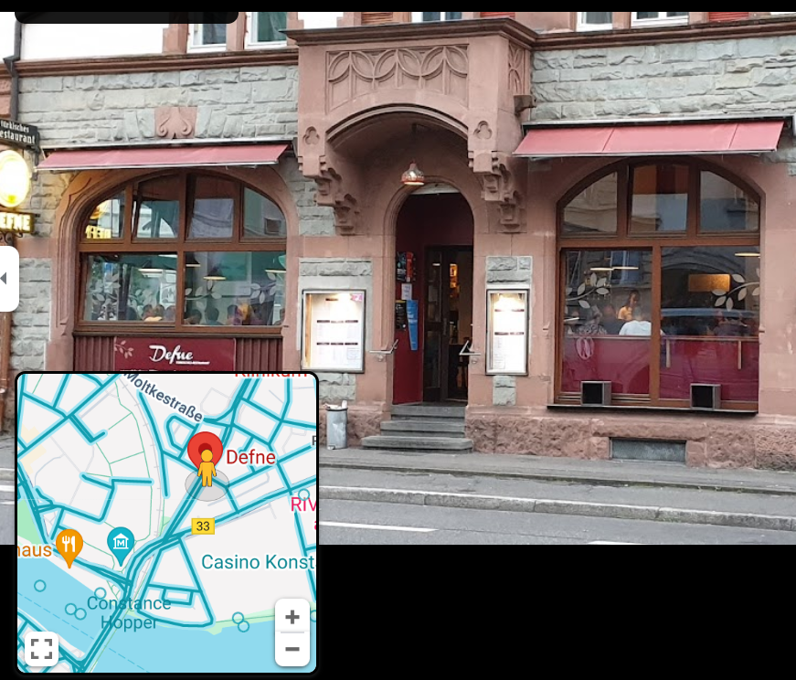]

---

# Introduction to Social Data Science

## 1. Course information

## *2. Introduction to Social Data Science*

## 3. Google Flu Trends

## 4. Future Orientation with search data


---


# What is the aim of Social Data Science?

> The aim of Social Data Science is   
**the Quantitative Understanding of Human Behavior**.  

- **Quantitative:** As opposed to qualitative or descriptive, we aim for robust findings grounded in strong evidence that can be quantified.  

- **Understanding:** Not just predicting, we want to be able to generalize and combine knowledge, and even to motivate interventions or policies.  

- **Human:**  We will not study particles or objects. Measurement validity and ethics will be a challenge.  

- **Behavior:** Observable changes, structures, dynamics, and patterns; not just stories or theories

---
#  How are we going to do it?
**Retrieving, processing, analyzing, and interpreting digital trace data.**  
<center>
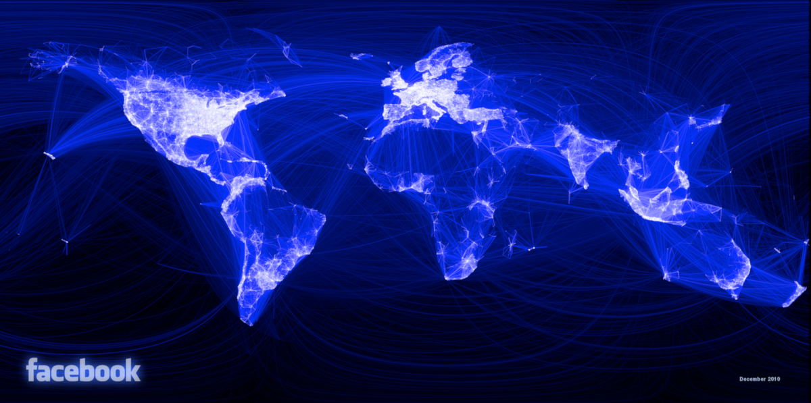
</center>

---
# What is data?

> **Data:** Facts in the form of stored and transmittable information.  

- *Data* is the plural of the Latin word *datum*. *Data* means ”given (things)”.  
- Data is given to us, it is not fabricated nor simulated.


---
# Why digital traces?

Data from digital traces have six properties that can complement other traditional data sources in the social sciences:

- **Big Data:** Observing large amounts of humans across demographics  

- **Fast Data:** Quantifying aspects of human behavior in real time  

- **Long Data:** Retrieving longitudinal data and at various timescales  

- **Deep Data:** Gathering persistent information on individuals  

- **Mixed Data:** Combining heterogeneous datasources and unstructured data  

- **Strange Data:** Locating small subcommunities or deviant behavior  

---

# What are the limitations of digital traces?

With the great potential of digital traces, aslo come great challenges:

- **Platform biases:** caused by their design, algorithms, social bots, etc

- **Data gatekeepers:** Not everyone can access some data sources

- **Performative behavior:** Talking online is not the same than offline.

- **Representativity issues:** Not everyone leaves digital traces. 

- **Observational data:** Testing causal mechanisms is not straightforward. 

- **The data deluge:** Too much data enables black-box predictions that can be useful but limit our understanding.

---

background-image: url(VennV2-1.svg)
background-size: 97%
---
background-image: url(VennV2.svg)
background-size: 97%

---

#  Google Flu Trends

## 1. Course information

## 2. Introduction to Social Data Science

## *3. Google Flu Trends*

## 4. Future Orientation with search data

---

# Google Trends

Google Trends is a website hosted by Google that allows you to get a measurement of Google search volume for a term

<center>
  
</center>

---

# Searching for various trends

    

---

# Comparing regions

A lower panel shows a comparison between countries or between regions within the country you filtered for.

    

---

# Exporting map data
    
- Check "Include low search volume regions"
---

# Export file format for maps

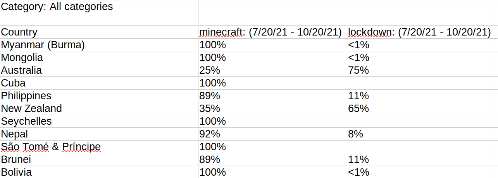

---

## Disambiguating queries across languages


---

## Nowcasting flu incidence with Google Trends

<div style="float:right">
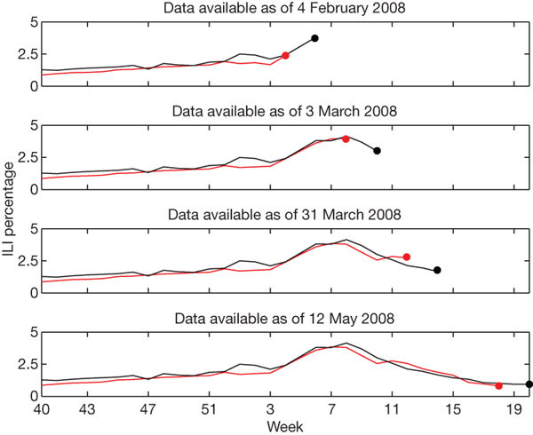  
</div>

**Nowcasting** is predicting the present. It provides an estimation of the value of a quantity based on signals that appear at the same time. 

Google Flu Trends aimed at nowcasting influenza-related physician visits based on Google search volumes. 

As reported in the [Nature paper](http://www.nature.com/nature/journal/v457/n7232/full/nature07634.html), Google Flu Trends achieved a high weekly accuracy between 2003 and 2008.

The figure shows the nowcasting result of Google flu trends. CDC data is published with a delay of two weeks.

---

## When Google Flu Trends Stopped working

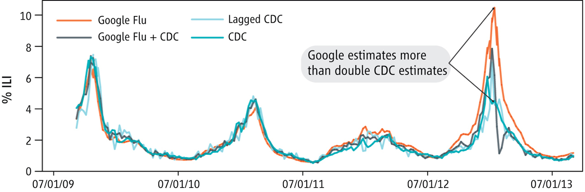
During the flu season of 2012/2013 Google Flu trends started overestimating the number of cases.  
[The Parable of Google Flu: Traps in Big Data Analysis. D. Lazer, R. Kennedy, G. King, A. Vespignani. Science (2014)](https://gking.harvard.edu/files/gking/files/0314policyforumff.pdf)

---
## Where Google trends works: consumer trends

.center[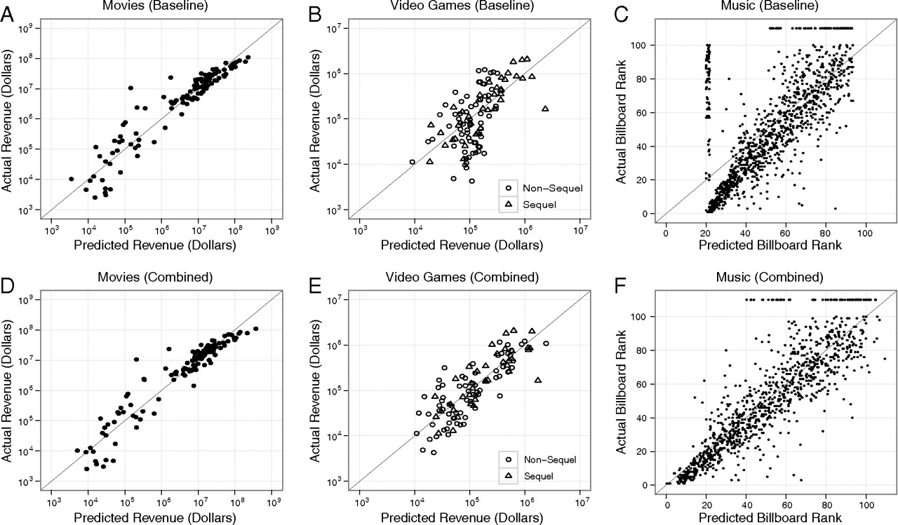]
[Predicting consumer behavior with Web search. S. Goel, et al. PNAS (2010)](https://www.pnas.org/doi/10.1073/pnas.1005962107)
---

# Comparing models in various cases

.center[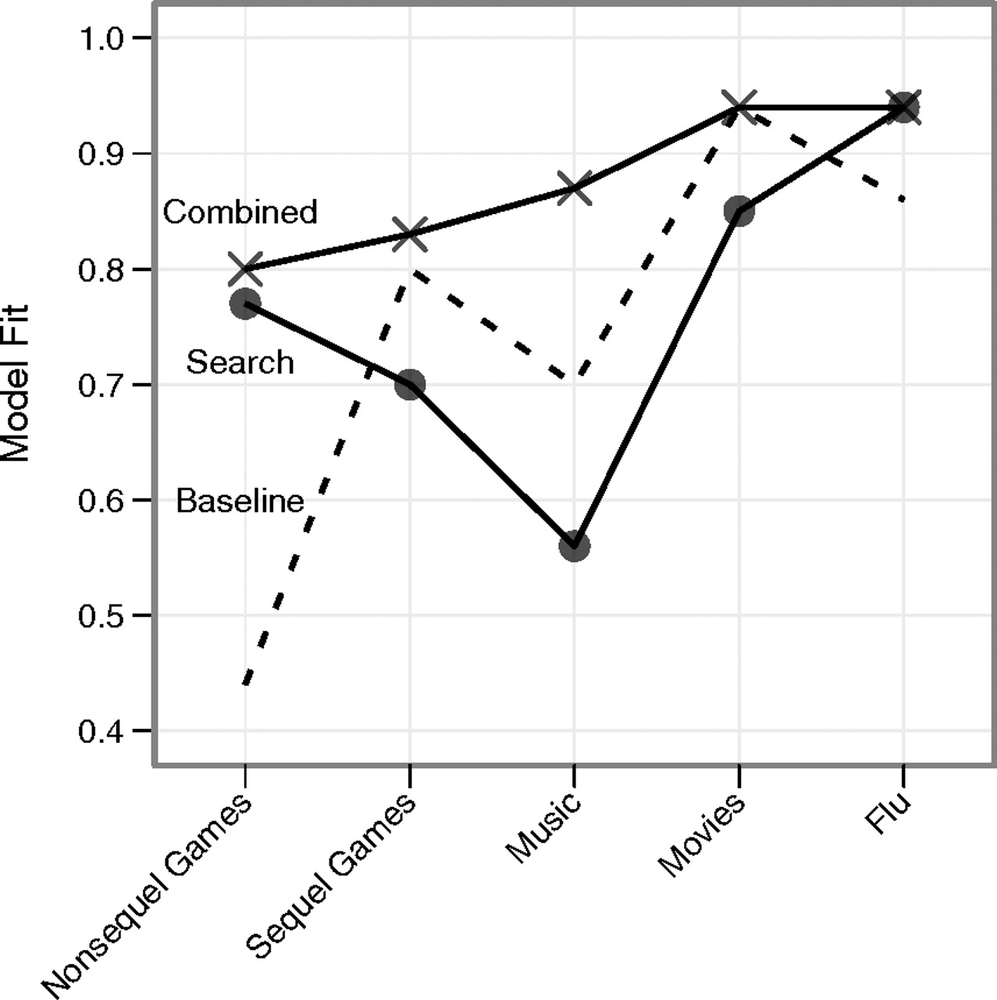]

---

# Big Data Hubris

.center[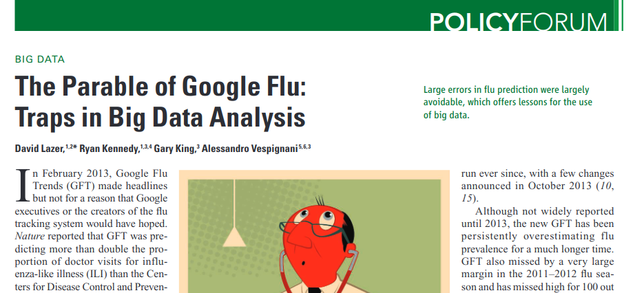]

Google Flu Trends is an example of **Big Data Hubris**: ”The often implicit assumption that big data are a substitute for, rather than a supplement to, traditional data collection and analysis” [(Lazer et al, Science, 2014)](http://science.sciencemag.org/content/343/6176/1203)

> Take home message: **All data is better than Big Data**

---

# Future Orientation with search data

## 1. Course information

## 2. Introduction to Social Data Science

## 3. Google Flu Trends

## *4. Future Orientation with search data*

---

## Long-term orientation and economic development
> **Long-Term Orientation (Geert Hofstede)**  
Long-term oriented societies believe that the most important events in life will occur in the future; short-term oriented societies believe that those events occurred in the past or take place now.

.center[]

---

# Temporal orientation and Google Trends

.center[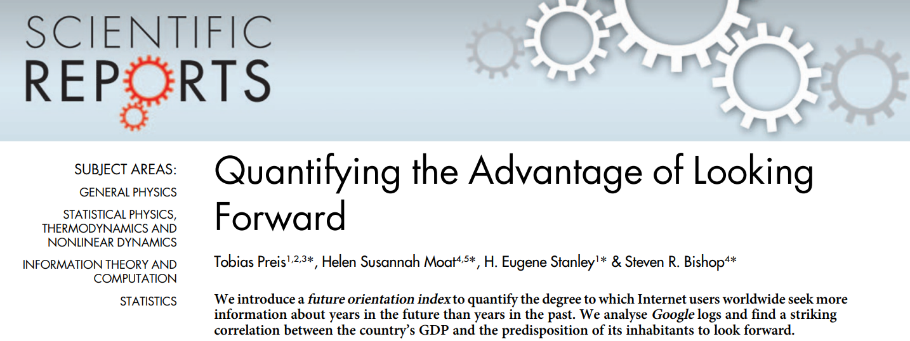]

[Quantifying the Advantage of Looking Forward. T. Preis, S. Moat, E. Stanley, S. Bishop. Scientific Reports (2012)](https://www.nature.com/articles/srep00350)


---

## Measuring the Future Orientation Index

[Pres et al. 2012](https://www.nature.com/articles/srep00350) proposed a way to measure how much a society looks towards the future with Google Trends, the Future Orientation Index (FOI). The FOI for a country *c* on year *y* is calculated as:  

.center[
$FOI_{c,y} = \frac{G(y+1,y,c)}{G(y-1,y,c)}$
]

where $G(y_1,y_2,c)$ is the Google Trends volume for searches for year $y_1$ during year $y_2$ from country $c$. 

The FOI measures the ratio of search volume from a country for next year divided by the search volume for the previous year in the same country.

---


# Example of trends for FOI

.center[]

---

# Example of trends for FOI
.center[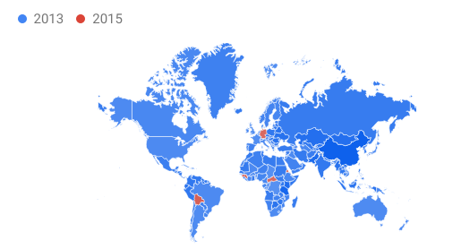]

---

# Correlating the FOI and GDP per capita


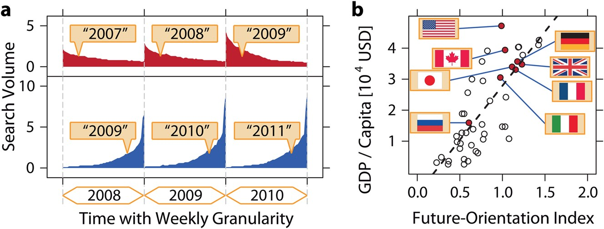
.right[Pearson correlation coefficient = 0.78]

---

# Summary

- **Introduction to Social Data Science**
  - Course contents include social dynamics, text analysis, social networks
  - Emphasis on critique and understanding of limitations and potentials


- **Introduction to Google trends**
  - Searching trends across time and regions in a comparative way
  - A black box with lots of known unknowns


- **Google Flu trends**
  - When Google trends started overestimating flu incidence
  - Big data models need to be compared with standard social science models


- **Temporal orientation and Google trends**
  - The Future Orientation Index
  - Correlating the FOI with GDP


  