```{r xaringan-themer, include=FALSE, warning=FALSE}
#This block contains the theme configuration for the CSS lab slides style
library(xaringanthemer)
library(showtext)
style_mono_accent(
  base_color = "#5c5c5c",
  text_font_size = "1.5rem",
  header_font_google = google_font("Arial"),
  text_font_google   = google_font("Arial", "300", "300i"),
  code_font_google   = google_font("Fira Mono")
)
```

```{r setup, include=FALSE}
options(htmltools.dir.version = FALSE)
```

layout: true

<div class="my-footer"><span>David Garcia - Social Data Science with Python</span></div> 

---
# So far

- Search behavior and future orientation


- Social Impact Theory


- Text and Sentiment Analysis
  - Unsupervised methods based on dictionaries
  - Supervised methods


- Fundamentals of network analysis
  - Definitions: edges, nodes
  - Concepts: distance, degree
  - Cognitive limits to degree
  - Centrality metrics to measure importance in a social network
  
---

# Overview

## 1. Coreness centrality and social resilience
## 2. Structural holes and communities
## 3. Assortativity
## 4. Permutation tests
---

# Why do online social networks collapse?
> **Social Resilience:** The ability of a community to withstand external stresses, disturbances, and environmental changes

.center[]
[Friendster Was the Best Social Media Site, Ever. Yudhistira Agato, Vice (2017)](https://www.vice.com/en/article/ezjqzn/friendster-was-the-best-social-media-site-ever-1)
---
# The rise and fall of Friendster

**Friendster** went from 80 Million active users to disappear completely.

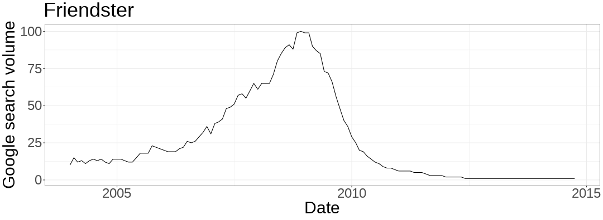
---

# The rise and fall of MySpace

**MySpace** went from being valued more than 12 Billion USD in 2008 to be bought by [Justin Timberlake for 35 Million USD](https://www.theguardian.com/technology/2011/jun/30/myspace-internet). 

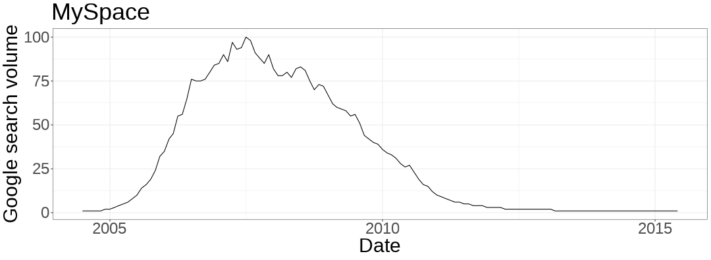


---

# The rise and fall of Orkut

**Orkut** was the first attempt of Google to launch an online social network. It was very popular in some countries but lost users to Facebook and it was eventually taken offline.

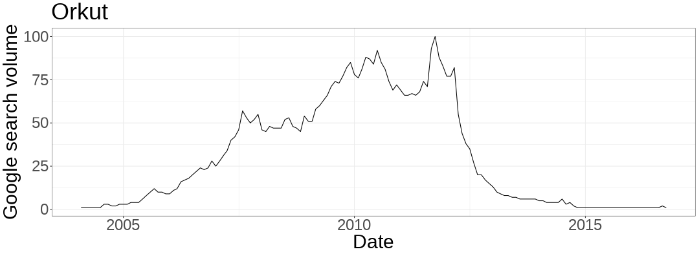

---

# Modelling social resilience online

Social resilience can be modelled as a process of how users stay active or inactive in a social networking site. 

If we consider social network users as rational, they will respond to incentives to stay active or to abandon social networks depending on **benefits and costs**.

**Benefits** can be quantified through the content users receive from their friends (shares, comments) and through the attention and support given by their friends (likes, votes).

A simple way to model monotonic benefits is proportionally to the active friends of a user $k_u$:

$$benefit_u = b * k_u$$
---

# Costs of using an online social network

<div style="float:right">

</div>
**Costs:** Using social network is not only benefits, there are also costs associated with being active.   
--

For example:
- Time spent to learn to use the interface of the platform  
- Risks of disclosing personal information  
- Opportunity costs: you could be doing something else  
- Economic costs, for example membership fees.

A common assumption about costs is that they are relatively similar for all users, thus modeling them as a constant $c$. Then, a user will become inactive when the total benefits are below the cost:

$$ b *k_u < c $$

---
.center[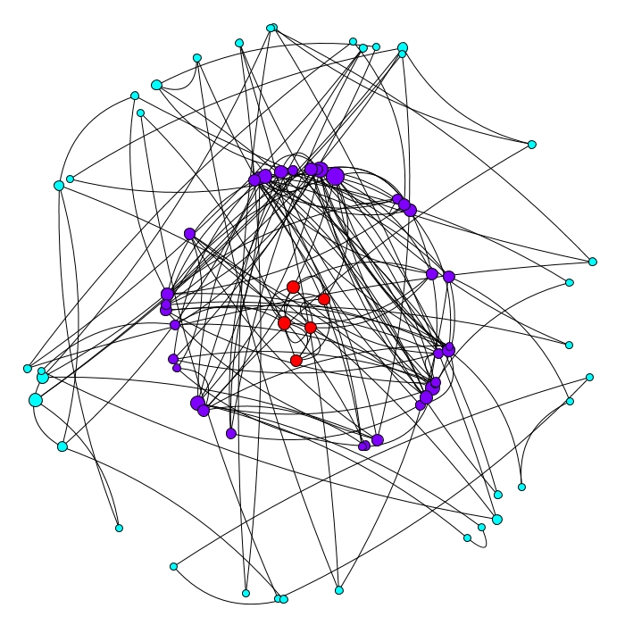]
---
.center[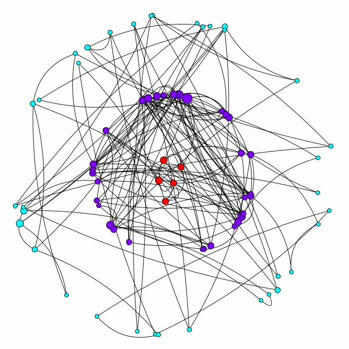]
---
.center[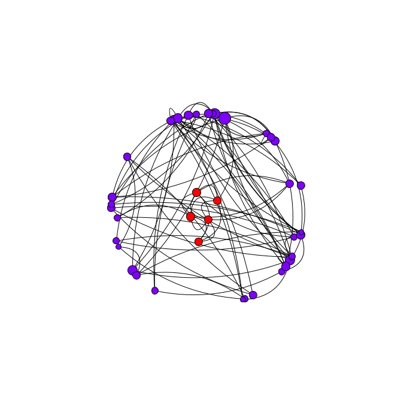]
---

# Iterative removal by degree

.center[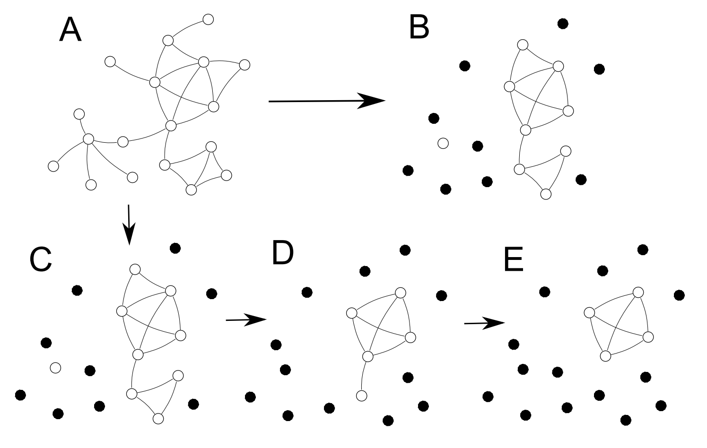]


---
# The k-core decomposition

The graph remaining after the cascade above is what is called a k-core

> **k-core**: A k-core of a graph $G$ is a maximal connected subgraph of $G$ in which all vertices have degree at least k.

For any network, you can calculate its k-core decomposition as follows:  

- Start with $k_s=1$  
- Remove all nodes with degree less than or equal to $k_s$ and their links  
- Repeat until all nodes have degree larger than $k_s$  
- Increase $k_s$ by one and repeat until no nodes are left

The nodes and the edges removed for certain of $k_s=k$ is called the **k-shell**.  
A **k-core** is the set of all k-shells with $k_s \geq k$.

---

# Coreness centrality

.center[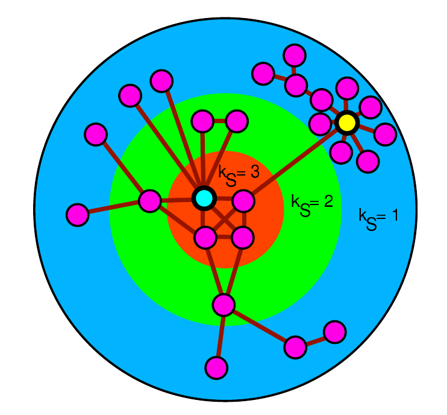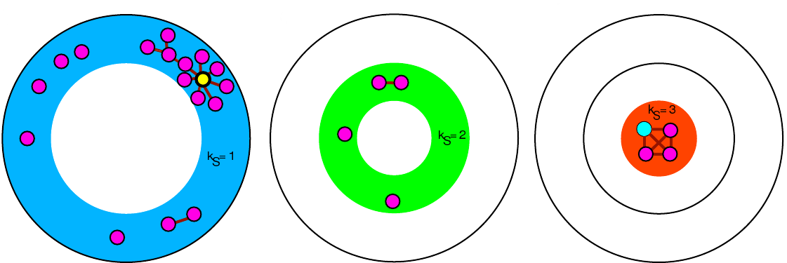]

The k-shell number of a node is also called **coreness centrality**.


Figure from [Kitsak et al. Identification of influential spreaders in complex networks. Nature Physics (2010)](https://www.nature.com/articles/nphys1746) 
---

# Coreness and social resilience

The cost to benefit ratio $c/b$ defines a critical value of the degree $K$, below which users with degree $k_u<K$ will leave the social network. The remaining active social network is the k-core corresponding to $K$. The **cumulative density function** of coreness values in the network serves as a **resilience function**:

.center[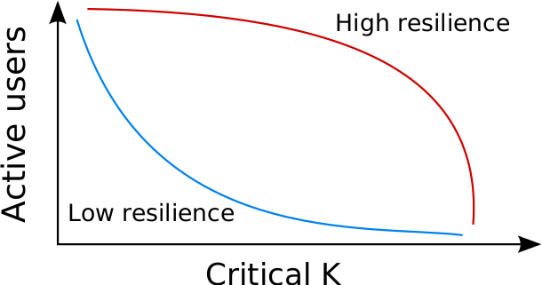]

---

# Backtesting with Friendster's collapse

.center[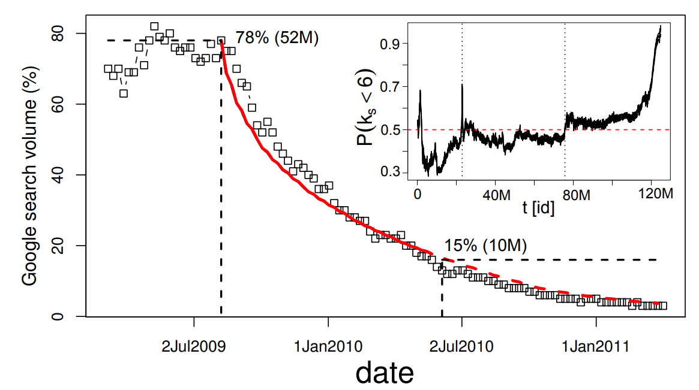]
Constantly decreasing $k_s$ in simple k-core model. Inset: fraction of nodes with coreness below the median over the lifetime of Friendster.

---

# Predicting Facebook's collapse

.pull-left[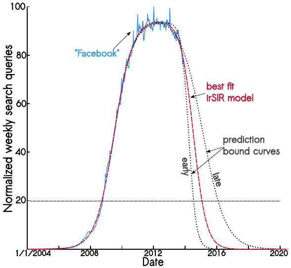]
.pull-right[

- Cannarella and Spechler, 2014

- Epidemics model applied to the decay of online social networks

- Google trends to measure the number of active Facebook users

- Extrapolation predicted that Facebook would lose 80% of its users by 2017

]


[Epidemiological modeling of online social network dynamics. John Cannarella, Joshua A. Spechler. Arxiv preprint (2014)](https://arxiv.org/pdf/1401.4208v1.pdf)


---

# Stretching the Google trends method

Data scientists at Facebook [replied to the Arxiv paper](https://www.facebook.com/notes/mike-develin/debunking-princeton/10151947421191849/) showing the problem with measuring social network use levels using Google Trends data. Applying the same methodology, Facebook researchers reached the conclusion that Princeton would lose 80% of its students by 2021:

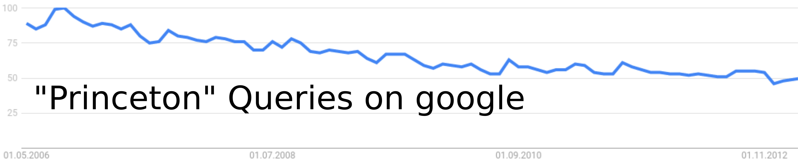

---

# Stretching the Google trends method

You can even apply it to air and come to the conclusion that the atmosphere will run out of air by 2060:

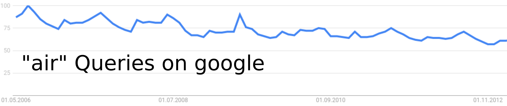

---

# Google trends for Facebook

The Facebook examples show that decrease in search volume is a decrease in information searching about the social network, not a decrease in access and use.

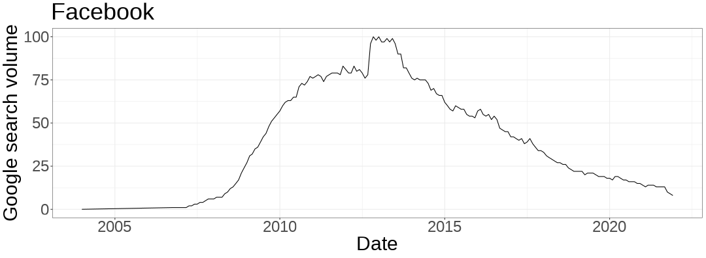


---

# Google trends for Twitter

Twitter is not living a second growth, in fact it's growth has been rather slow to stagnant for a few years, even though it appears it is gaining users after Trump's permanent suspension.

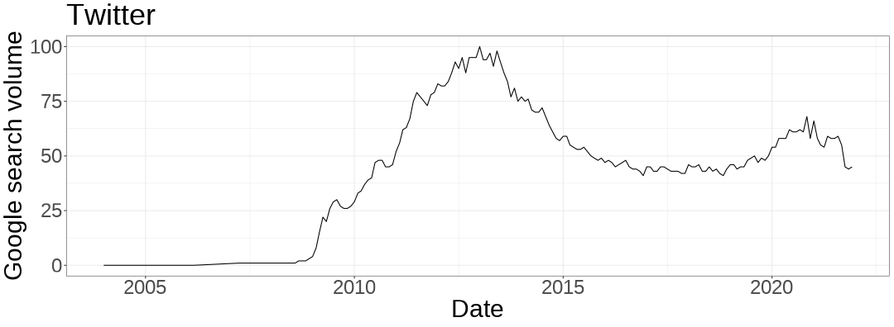


---

# Temporal validity issues

</br>
A more accurate way to measure activity in a social network is Bruno Ribeiro's [approach using Alexa data](https://dl.acm.org/doi/abs/10.1145/2566486.2567984), but Alexa focuses on website visits without considering access through mobile apps. 


</br>
Measurement is always an important issue in Computational Social Systems, and just because a paper used a measurement method few years ago, it does not mean it is valid today.

</br>
> **Take home message:** Your measures based on today's digital traces might not work on tomorrow's

---

#  Structural holes and communities

## 1. Coreness centrality and social resilience
## *2. Structural holes and communities*
## 3. Assortativity
## 4. Permutation tests
---


# Triadic closure


<div style="float:right">

</div>

>  **Triadic closure:** The tendency of individuals in social networks to create links to neighbors at distance 2

**Local clustering coefficient**:

$$C_i = \frac{2*t(i)}{d_i *(d_i−1)}$$

- $d_{out}(i)$ is the outdegree of $i$ (>1) 
- $t(i)$ is the number of pairs of neighbors of $i$ that are connected
- can be averaged or computed globally

---

# The strength of weak ties

<div style="float:right">
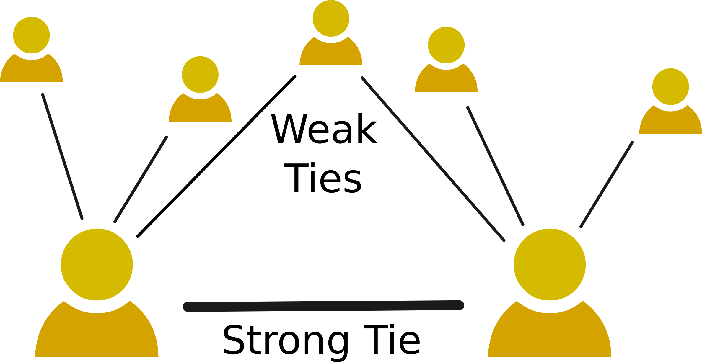
</div>

**Strong ties:** People who are very close to you (family, friends, etc.)
- Provide reciprocal emotional support
- Long-lasting, require energy and time

**Weak ties:** People you know but not very close to you (colleagues from work, school, etc.)
- Provide information, for example about employment and housing
- Are also faster to disappear

> **The strength of weak ties:** Weak ties are weaker than strong ties, but are also many more than strong ties. (Mark Granovetter) 

---

# Structural holes and communities

.center[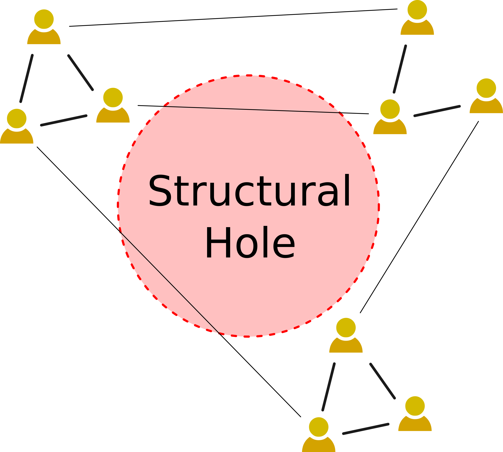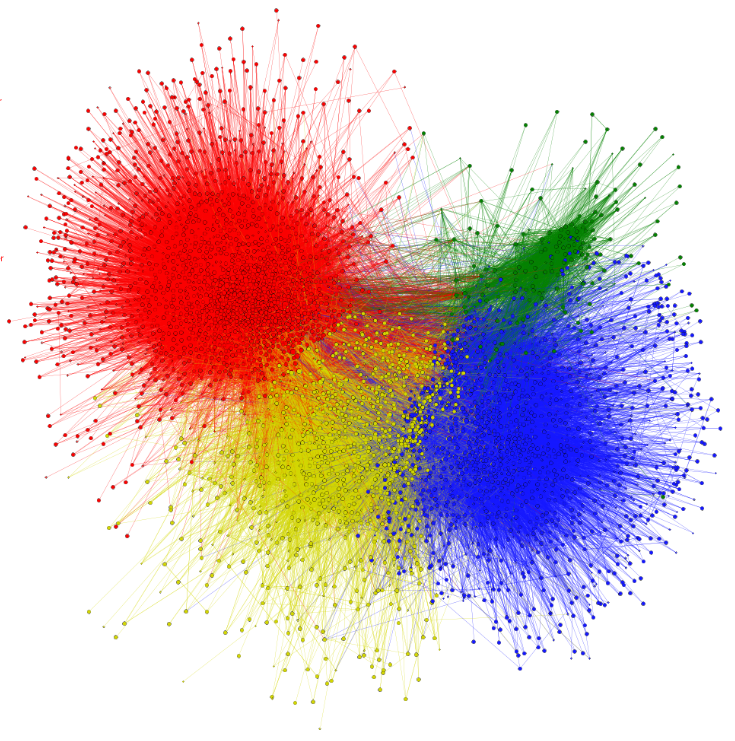]

---

## When holes are bridged: The small world concept

Small world networks have the following three properties:  
- Most nodes are not neighbors (sparse network)  
- The mean distance between two nodes is small  
- They have high global clustering coefficient

<div style="float:right">

</div>


**Stanley Milgram's experiment:**

- 160 people in Omaha try to reach one person in Boston by mail to their acquitances
- 44 letters reached the target with six steps on average
- Short path length as evidence of small-world
- Average path length on Facebook is 4.5


---

## Measuring community structure: Q-modularity

The measure of [**modularity**](https://www.pnas.org/content/103/23/8577.short) quantifies the tendency of a network to be divided in densely connected subgroups that are sparsely connected across groups.   
**Q-modularity** measures this tendency:

$$Q = \frac{1}{2m} \sum_{u,v} [ A_{u,v} - \frac{k_u k_v}{2m} ]\delta(c_u, c_v)$$
- $u$ and $v$ are two nodes of the network. The sum goes over all pairs of nodes.
- $m$ is the number of edges  
- $A$ is the adjacency matrix ($A_{u,v} = 1$ if and only if u and v are connected)  
- $k_u$ and $k_v$ are the degrees of $u$ and $v$  
- $c_u$ is the community of $u$ and $c_v$ is the community of $v$  
- $δ(c_u,c_v)$ takes value $1$ if and only if u and v are in the same community, otherwise it's $0$  


---

## Finding community structures

.center[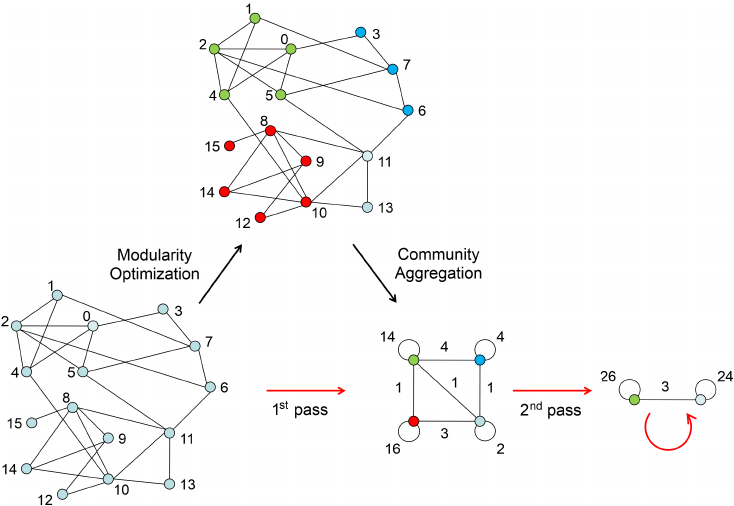]  
.center[Example: Louvain algorithm]


---


# Assortativity

## 1. Coreness centrality and social resilience
## 2. Structural holes and communities
## *3. Assortativity*
## 4. Permutation tests
---

# Assortativity

.center[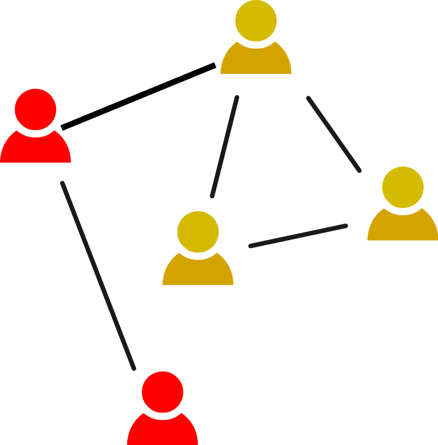  ]

> **Assortativity:** A network property by which similar nodes are more likely to be connected than dissimilar nodes

---

# Measuring Assortativity

Similarity is based on some node property, e.g. degree, age, political orientation, gender... 
Can be measured with the **assortativity coefficient**:

\begin{equation*}
r=\frac{\sum_c e_{cc}-\sum_c a_c b_c}{1-\sum_c a_c b_c}
\end{equation*}

- $c$ are the classes of nodes
- $e_{cd}$ is the **fraction of all edges** connecting nodes of class $c$ with nodes of class $d$
- $e_{cc}$ is the fraction of all edges connecting two nodes of class $c$
- $a_c=\sum_d e_{cd}$, and $b_c=\sum_d e_{dc}$ (endpoint class fractions)


---

## Three mechanisms that generate assortativity

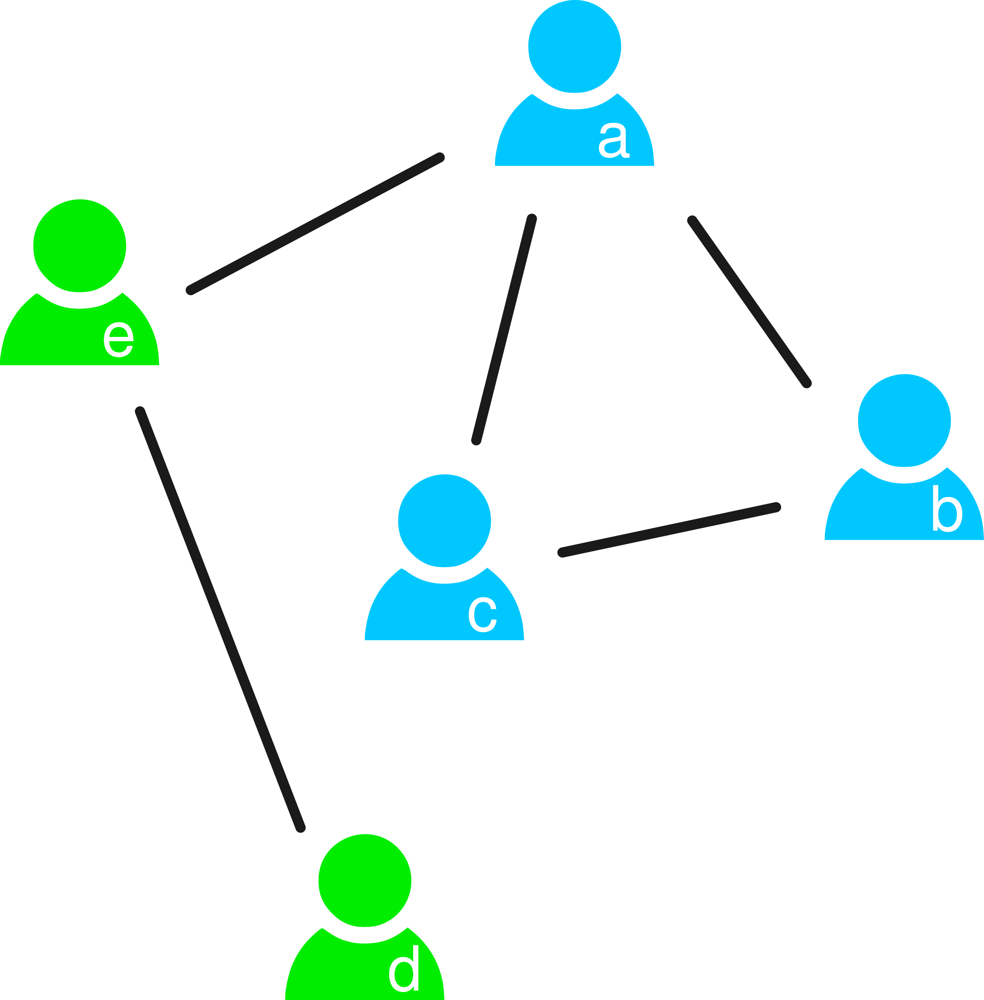 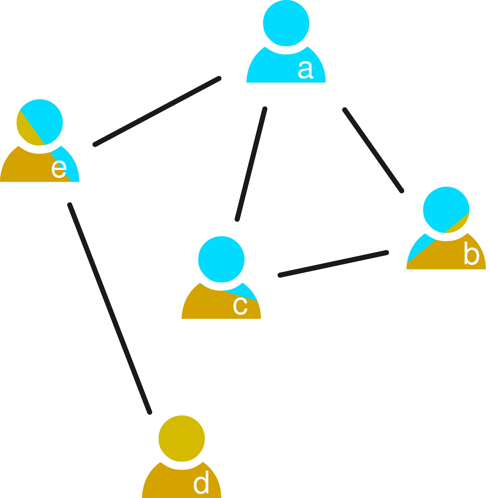 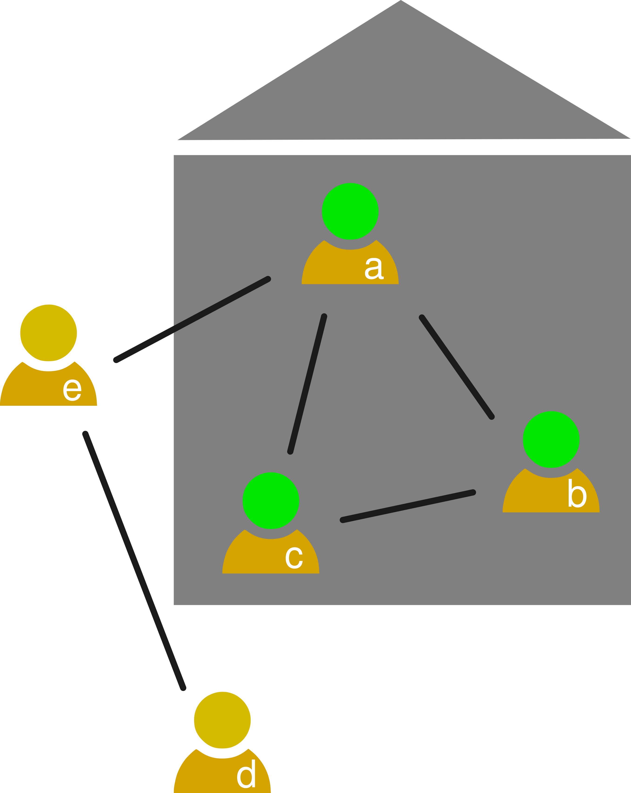

.center[**Homophily, social contagion, and confounding**]

---


## Homophily

  

> **Homophily:** Phenomenon in which people are more likely to create social links to similar than to dissimilar people

---

## Social Contagion

  

> **Social contagion:** Phenomenon in which people tend to adopt behaviors of their social contacts

---

## Confounding

  

> **Confounding:** External effects can produce both link creation and node attributes (independent of the network topology)

---

# Assortativity of happiness

.center[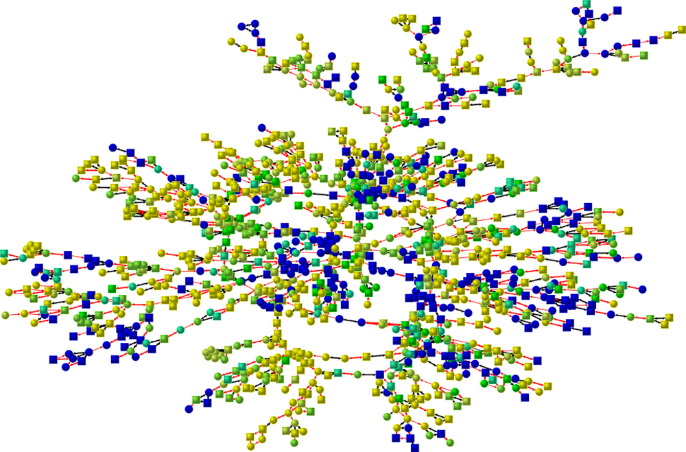]


---


# *Assortativity*

## 1. Coreness centrality and social resilience
## 2. Structural holes and communities
## 3. Assortativity
## *4. Permutation tests*
---

# Null models

Once we have measured something or got a statistical result from our analysis, we might ask ourselves: What is the probability that this result can appear due to chance alone? 


- If the coin is fair: P(H) = 1/2 and P(HHHHH) = 1/32
- In the case of getting five heads, how plausible is that the coin is fair?

---

# Permutation tests

- Example: correlation coefficient between two variables $X$ and $Y$: $\rho(X,Y)$
- What is the probability that we could measure a similar or even stronger correlation if $X$ and $Y$ were completely independent?
- We can answer this questions with a permutation test 
- A permutation test has four components:

1. A **test statistic**,  e.g. $\rho(X,Y)$
2. A **null hypothesis**, which is a statement about the value of our test statistic when "nothing interesting happens". 
  - It is often denoted as $H_0$ and in this case it would be $H_0: \rho(X,Y)=0$.

---
# Permutation tests
1. A **test statistic**,  e.g. $\rho(X,Y)$
2. A **null hypothesis**, which is a statement about the value of our test statistic when "nothing interesting happens". 
  - It is often denoted as $H_0$ and in this case it would be $H_0: \rho(X,Y)=0$.
3. An **alternative hypothesis**, which is another statement about the value of the test statistic that stems from our theory or research question. It is often denoted as $H_1$ and, for example, it could be $H_1: \rho(X,Y)>0$. 
  - The alternative hypothesis and the null hypothesis have to be contradictory. Both can't be true at the same time, but both could be false.
4. A **permutation set** with $N$ random permutations or shuffles of the data. Permutations in this set model a world in which the null hypothesis is true and any measurement different than the one specified in the null hypothesis is due to chance alone.

---

# Permutation tests: FOI and GDP


.pull-left[
- Example: correlation between the Future Orientation Index and the GDP per capita of countries

Correlation in this example: 0.6841329
]
.pull-right[
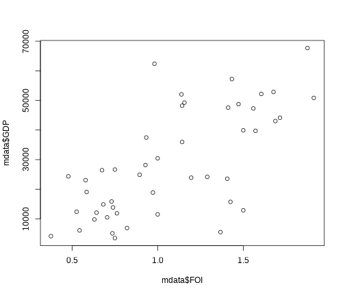
]
---

# Permuted data

.pull-left[
- If we shuffle one of the columns, the correlation will be close to zero, for example 0.08600673

- Idea: repeat this many times to estimate the chances of having a high correlation even though data was permuted
]
.pull-right[
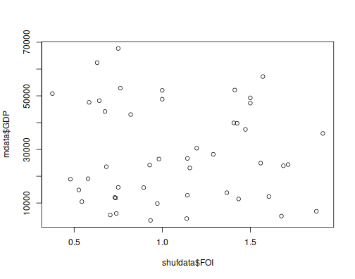
]

---


# Histogram of permutation results

.center[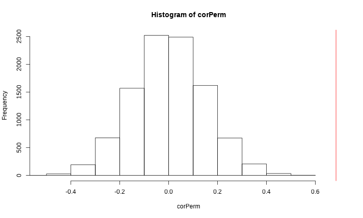]

The red line shows the original correlation without reshuffling

---

# The p-value of a permutation test

The p-value is a way to summarize the results of a permutation test. 

> **p-value:** Given that the null hypothesis is true, the p-value is the probability that we measure a statistic at least as extreme as the observed result

- **A common misconception is that the p-value measures the probability that the null hypothesis is true**. 

- The p-value measures the plausibility of what we measure under the null hypothesis, which is very different. 
---

# Calculating a p-value 

- *one-sided p-value*: proportion of permutations with a value of the statistic at least as large as the observed one. 
- *two-sided p-value*: proportion of permutations with an absolute value of the statistic at least as large as the observed one.


We can calculate the one-sided p-value from the permutation test:
```{r, eval=F, echo=T}
p_value_Cor = (sum(corPerm>=corObserved)+1)/length(corPerm)
```
 
- We add one to the numerator to ensure we don't say zero
- The result is "significant" (p<0.05), but careful interpreting that word!
- How many times to permute: $10000$ times is safe for (p<0.05)

---


# Summary

- **Social resilience as networked decisions**
  - A decision of a user leaving affects the situation of other users
  - This can be mapped to network metrics like coreness centrality


- **Empirical analysis of online social resilience**
  - Historical analysis of the Friendster collapse
  - Limits of Google trends: the Facebook case

  
- **Social network structures**
  - Structural holes and communities
  - Small worlds


- **Assortativity: when nodes have attributes**
  - Assortativity coefficient
  - Three processes to generate assortative networks


- **Permutation tests**
  - Permuting to simulate a null model
  - P-values as a way to summarize the result